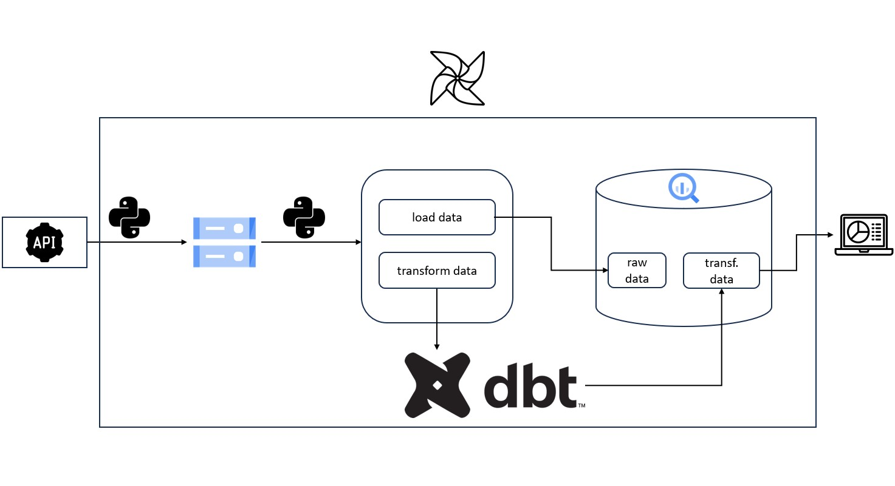

# O Projeto

Este projeto consiste em um Datapipeline, desenvolvido para extrair, transformar e disponibilizar dados valiosos de forma eficiente. Desde a fase inicial de extração até a entrega de informações tratadas, nosso Datapipeline oferece uma abordagem abrangente para impulsionar insights e tomada de decisões fundamentadas.

Utilizaremos as mais recentes tecnologias, tornando o projeto capaz de extrair dados de várias fontes, independentemente do tamanho ou complexidade, garantindo uma coleta confiável.

## Metodologia

O projeto será desenvolvido seguindo uma configuração bem definida, utilizando as seguintes tecnologias para garantir uma implementação robusta e escalável:

- Python: A linguagem de programação Python foi escolhida para as etapas de extração e tratamento inicial dos dados. Sua versatilidade e rica biblioteca de pacotes facilitam a manipulação e preparação dos dados, garantindo uma base sólida para as próximas etapas do pipeline.

- GCP (Google Cloud Platform): Optamos pela GCP como nosso provedor de nuvem devido à sua confiabilidade e diversas ferramentas de gerenciamento de dados. Faremos uso de um Bucket para armazenar os dados brutos e, posteriormente, disponibilizá-los em uma tabela no BigQuery. Isso nos proporcionará armazenamento seguro e escalável, além de uma plataforma poderosa para análise de dados.

- DBT (Data Build Tool): Utilizaremos o DBT para realizar o refinamento dos dados, transformando-os em informações valiosas. Com suas funcionalidades de modelagem e organização, poderemos criar pipelines de dados eficientes e fáceis de manter, garantindo a confiabilidade dos resultados.

- Airflow: A automação é fundamental em nosso projeto, e o Airflow será o orquestrador escolhido para agendar e gerenciar todo o processo de forma automática. Com ele, poderemos definir fluxos de trabalho complexos e monitorar o progresso do pipeline de maneira eficiente.

- Docker (Contêiner): Para garantir a portabilidade e isolamento de nossos componentes, empacotaremos nossa aplicação em contêineres usando o Docker. Isso nos permitirá executar os mesmos processos de forma consistente em diferentes ambientes, desde o desenvolvimento até a produção.

- Kubernetes: Faremos uso de um cluster Kubernetes para a execução de todas as etapas do projeto. A escalabilidade e a capacidade de gerenciar containers em larga escala tornam o Kubernetes uma escolha ideal para garantir o processamento eficiente e confiável dos dados.

## Dados de Viagens de Táxis, Veículos de Aluguel e Limousines de Nova York

Este projeto utilizará dados de viagens fornecidos pela NYC Taxi & Limousine Commission, agência responsável por licenciar e regular os táxis, veículos de aluguel e limousines da cidade de Nova York (NY). Os dados consistem em informações detalhadas sobre as viagens realizadas por esses veículos em determinado período de tempo.

Estes dados são públicos e podem ser encontrados no link abaixo: https://www.nyc.gov/site/tlc/index.page

## Arquitetura do Projeto

## Em construção...